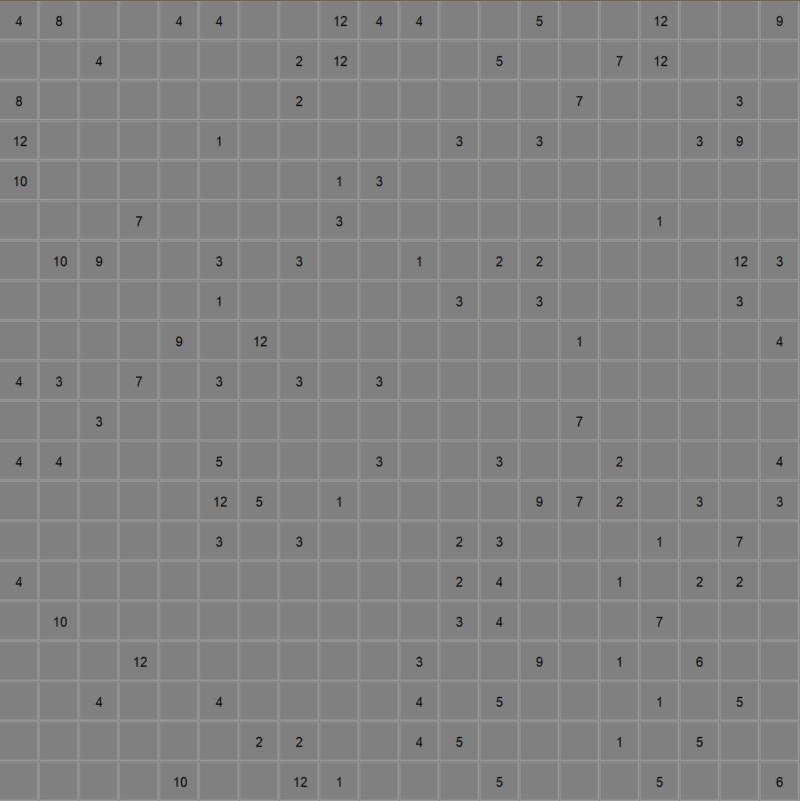
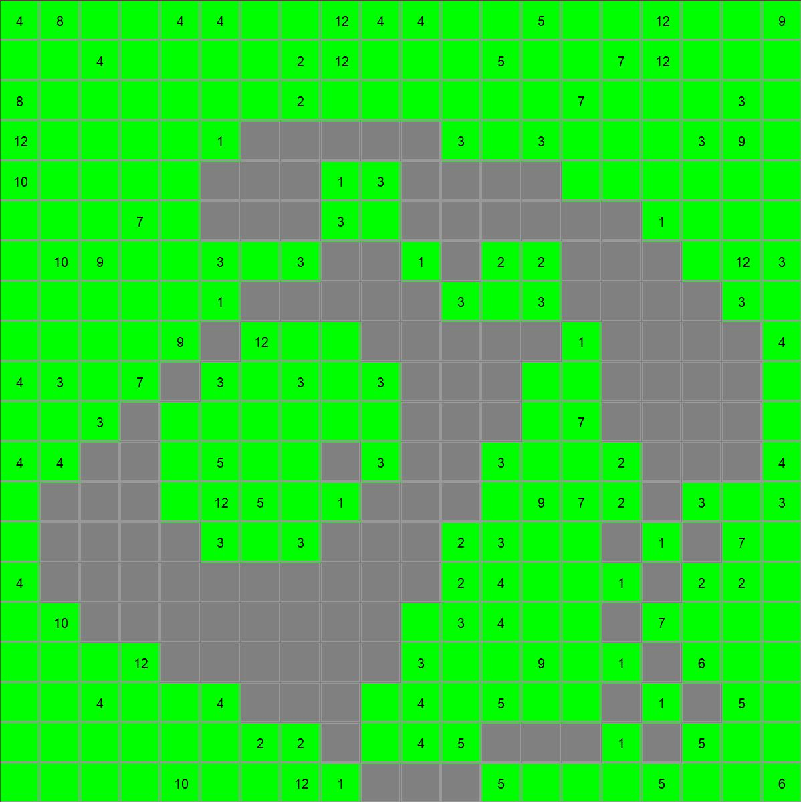

# Logipix Java Solver

**Logipix Java Solver** is a software implementing various solvers for the Logipix game in java.

## About Logipix

**Logipix** is a puzzle game where players are given a grid filled with numbers. The objective is to connect cells with the same number such that the length of the connecting path matches the given number.

<table>
  <tr>
    <td>
      
      
Unsolved Puzzle

    </td>
    <td>
      
      
Solved Puzzle

    </td>
  </tr>
</table>

## Directory Structure
- data/: Contains example instances and images.
- src/: Contains the source .java files.

## Prerequisites
- Java JDK 21 (or newer).

## Setup and Usage
1. Choose instance and solver in `Logipix.java`.
2. Compile the source files.
3. Run Logipix file.
4. Click on the 'start solving' button.

## Instance Format
An instance comes in a `.txt` format, containing
- A single integer on the first line representing the number of columns (`m`).
- A single integer on the second line indicating the number of rows (`n`).
- Followed by `n` lines of `m` integers each, depicting the grid.

## Solvers
- **Backtracking Naive Solver**: Utilizes a simple backtracking approach.
- **Combination Exclusion Solver**: An improved version of backtracking where cells on every path between two identical numbers are pre-colored.
- **Improved Combination Exclusion Solver**: Builds upon the Combination Exclusion Solver by introducing an oracle. This oracle, given a specific position, number, and square side size, indicates whether there's a cell with the specified number within the square. This solver works only for instances with numbers below 64.

**Note**: The effectiveness of each solver can vary depending on the specific puzzle instance. 